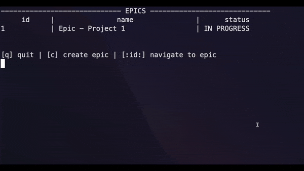

# letsgetrusty
Rust learning journey
**[Jira-cli](https://github.com/papesdiop/letsgetrusty/tree/Jira-cli)** is built on Jira-cli branch 

**[StackOverflow-API](https://github.com/papesdiop/letsgetrusty/tree/stackoverflow-api)** is built on stackoverflow-api branch 

Vscode extensions used :
- rust-analyzer
- CodeLLDB
- Crates
- Error Lens
- Even Better TOML
- Search crates.io
